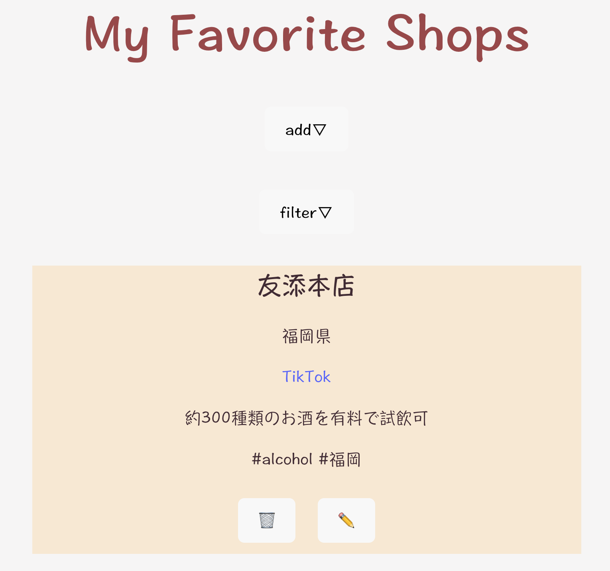
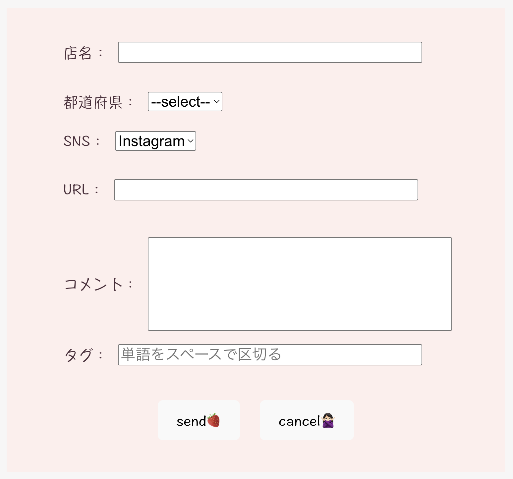
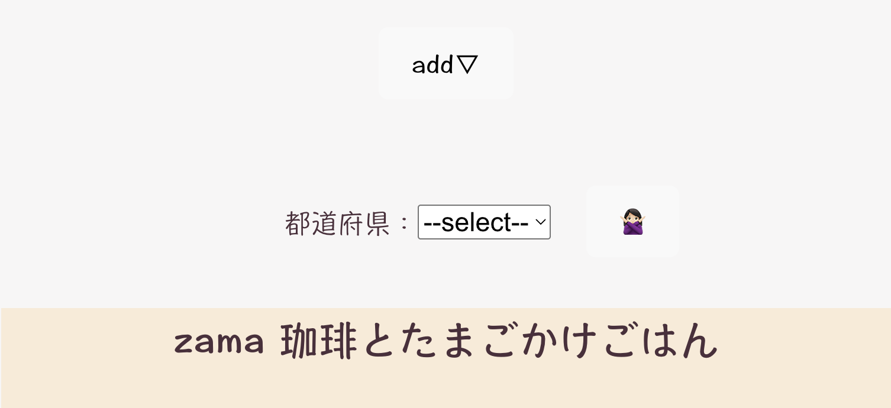
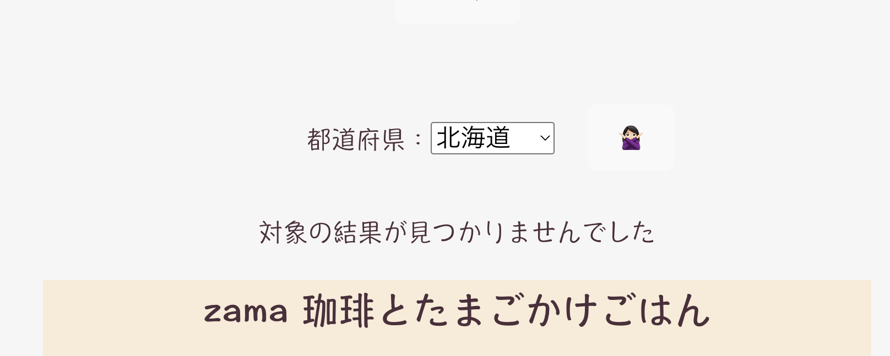
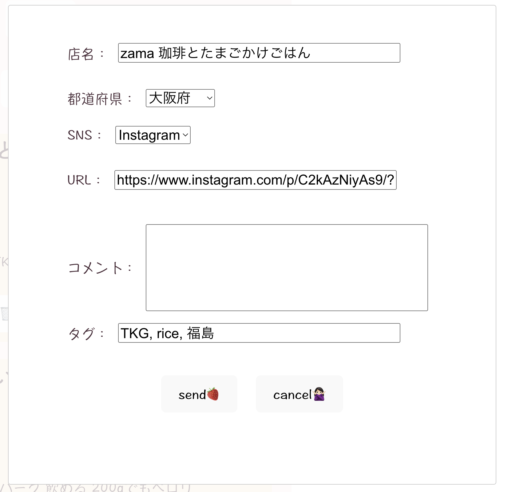
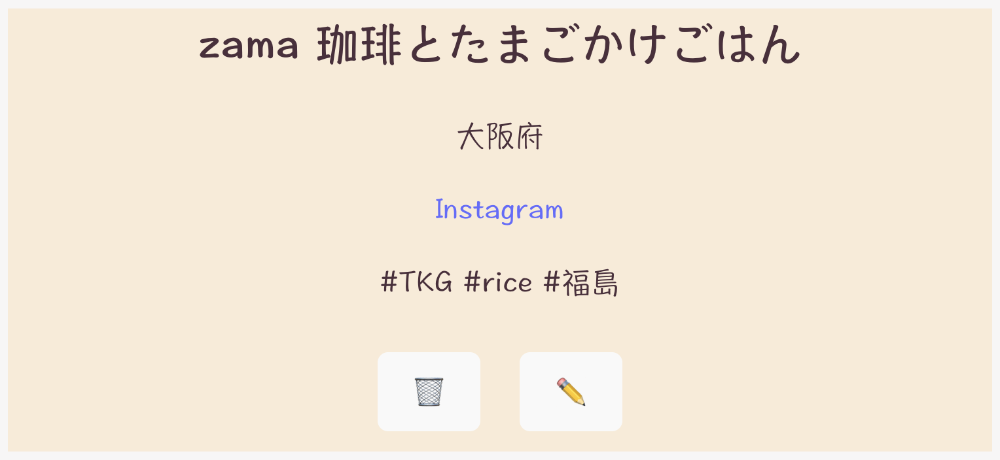

# My Favorite Shops  
## 概要
 いろんなSNSでお店調べてブックマークするけど、ごちゃごちゃになっちゃう...  
 テレビで見たお店とかメモしたいけど、メモ帳だと管理が大変  
 などなど、自分の行きたいお店だったりの管理って上手にすること難しくないですか？  
 そこで、管理しやすいアプリ作ってみました！  

## 必要な環境設定
 - PostgreSQLのインスタンスを起動  
 - mymvpという名前のデータベースを作成  
 - このレポジトリをクローン
 - npm run buildを実行
   これを実行することでマイグレーションが実行され、シードデータが入ります
 - .envファイルを.gitignoreと同じ場所に作成  
 ここではデータベースがPostgreSQLということとUserの設定、環境設定を行う必要があります。  
 knexfileやindex.jsを参考に設定を行ってください  
 - npm run startを実行　サーバーを起動させます  

サーバーを起動させてlocalhostで起動させるとアプリが動かせます  

## アプリの使用方法
 アプリを開いたら以下の画面が出てきます。  
   

 * POSTの方法  
   * addボタンを押すと以下の画面が出てきます  
     
   * 入力必須項目：店名、タグ  
    ※タグは必ず単語を半角のスペースで区切るようにしてください  
    ※正しく入力できていないと表示がおかしくなってしまう可能性があります  
   * 都道府県とSNSも必ず選択するようにしてください  
   * コメントとURLについては任意の項目になります  
   * URLを入れておくとリンク先を作成することができます  
   * 入力が終われば、send🍓ボタンを押してください  
   * 入力をキャンセルしたい場合、cancel🙅🏻‍♀️ボタンを押してください  
   * sendまたはcancelを押すと投稿用の画面が隠されます  
   * 投稿をしている場合、投稿した情報が一番上に表示されます  

 * 都道府県でフィルタをかける方法  
   * filterボタンを押すと都道府県を選択することができます  
     
   * 絞りたい都道府県を選択するとその都道府県で絞られたリストが表示されます  
   * 選択した都道府県の投稿がない場合は、”対象の結果が見つかりませんでした”と表示されます  
     
   * 🙅🏻‍♀️ボタンをクリックするとフィルタが解除され、選択バーも隠されます  

 * 投稿内容を修正する方法  
   * 各投稿の下部にある✏️ボタンを押すと以下の画面が表示されます  
     
   * 修正したい箇所を修正します  
   * 投稿時と同じように店名とタグだけは空欄にならないようにしてください  
   * 修正が終われば、send🍓ボタンを押してください  
   * 修正をキャンセルしたい場合、cancel🙅🏻‍♀️ボタンを押してください  
   * sendまたはcancelボタンを押すとモーダル表示が消えます  
   * 修正を行なった場合、修正された内容に投稿が変わっています  

 * 投稿を削除する方法  
   * 各投稿の下部にある🗑️ボタンを押すと投稿が削除されます  
     

 * リンク先にアクセスする方法  
   * 各投稿の中にSNS名が表示されているので、それをクリックすると投稿時に入力したリンク先に飛ぶことができます  
     

## 注意事項
 * フィルタを使用した時、選択した都道府県の投稿がないのに”対象の結果が見つかりませんでした”と表示されない  
   フィルタをしたのに関わらず、”対象の結果が見つかりませんでした”と表示はされず全部の投稿が表示されることがたまにあります。  
   これはフィルタがうまく動いていないのではなく、ステート管理などがうまくできていないためです  
   すみません🙇‍♀️

## 未実装の内容
 本当は実装したかった機能がまだあります  
 * タグを使用した絞り込み  
 　　都道府県でのフィルタだけでなく、タグでの絞り込みもしたかったけど時間がなかったため断念。。。  
 　　中間テーブルを用意して絞り込めるようにしたかった
 * mapの表示  
 　　 googlemapへのリンクは作れたが、うまくお店を検索して表示させるということができなかった  
 　　 マップに繋げられたら別の目的地とかからの距離とか簡単に見れたのに。。。

 

